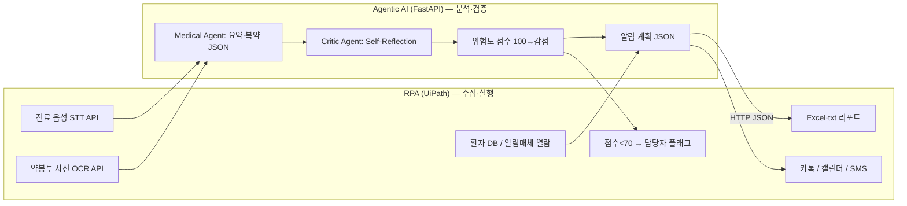

# 1. 아키텍처와 워크플로우 (Why & How)

## 1.1 왜 RPA + Agentic AI를 나누는가?

| 관점 | RPA (UiPath) | Agentic AI (Python/LLM) |
|------|----------------|-------------------------|
| 강점 | UI·파일·엑셀·레거시 연동, 반복 실행 | 비정형 텍스트 이해, 요약, 검증, JSON 구조화 |
| 약점 | STT/OCR 오인식 **판단** 불가 | 브라우저/로컬 파일 직접 조작은 부적합 |
| 역할 | **수집·실행**(팔/다리) | **분석·검증·점수**(두뇌) |

**핵심:** STT·OCR은 오류가 날 수 있는 *불안정 입력*입니다. RPA는 “가져오기만” 하고, LLM이 문맥으로 보정·요약·위험도 판단을 하면 시스템이 견고해집니다.  
회의록의 **회의록(STT) + 약봉투(OCR) 하이브리드**는 이 분업을 그대로 반영합니다.

**MSA 관점:** STT 모듈, OCR 모듈, 분석 API, 알림 모듈을 분리하면 카카오톡·캘린더·새 에이전트 추가 시 전체를 갈아엎지 않습니다.

---

## 1.2 전체 워크플로우 (발표용 다이어그램)

---

## 1.3 단계별 표 (PPT에 그대로 사용)

| 단계 | 담당 | To-Be | 데모 (이 repo) |
|------|------|--------|----------------|
| 1 수집 | RPA | UiPath가 STT/OCR API 호출 → 텍스트 변수 | `sample_input.json` / Input Dialog |
| 2 분석 | Agentic AI | Medical Agent → 복약 JSON | `POST /analyze` |
| 2b 검증 | Agentic AI | Critic Self-Reflection 루프 | `reflection_logs` (mock 1회 수정) |
| 3 점수 | Agentic AI | 위험도 100점 − 감점 | `risk_score` |
| 4 병합 | Agentic AI | 분석+점수+알림계획 JSON | API 응답 body |
| 5 실행 | RPA | Excel, 알림, 재검토 플래그 | `rpa_actions` + txt 파일 |

---

## 1.4 하이브리드 배포 (교수님·데모 설명용)

- **AI API:** Render 등 PaaS (무료, GitHub 연동)
- **RPA:** 팀장/데모 PC 로컬 UiPath
- **이유:** RPA는 파일·병원 PC 환경에 묶이기 쉽고, AI는 HTTP로만 붙이면 결합도가 낮아짐 → **로컬 RPA + 클라우드 두뇌**

---

## 1.5 13주차 발표 시 연출 순서 (추천)

1. PPT: 위 mermaid + 역할 분리 표  
2. 터미널: `python run_standalone.py` → Self-Reflection 로그·점수 출력  
3. 브라우저: `/docs`에서 `sample_input`으로 `POST /analyze`  
4. UiPath: HTTP Request → JSON 받아 Excel 저장 (가이드 04 참고)  
5. “to_be_generated” 구간을 노란색으로 PPT에 표시 → 로드맵 명확화
