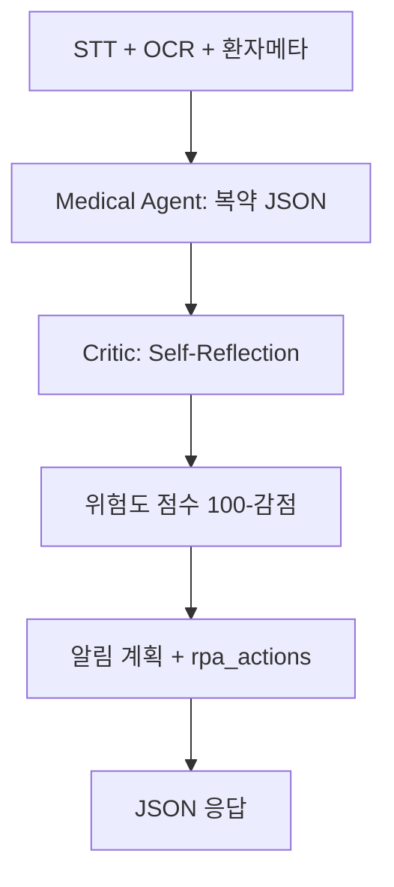

# 13주차 설계 코칭 발표자료 (PPT 초안)

> **수업:** 5/25(월) 기말 프로젝트 코칭 ① — 설계 안내 (Zoom)  
> **형식:** 15분 발표 + 5분 Q&A · **목적:** 최종 시연이 아니라 **설계 점검**  
> 아래 `[ ]`는 팀에서 채워 넣을 항목입니다.

---

## 1장. 프로젝트 개요

| 항목 | 내용 |
|------|------|
| **팀명** | [팀명 입력] |
| **팀장** | [이름] |
| **팀원** | [이름1 — 역할], [이름2 — 역할], [이름3 — 역할] |
| **프로젝트 제목** | **Atlas Medical Care** — 진료·복약 하이브리드 자동화 (STT + 약봉투 OCR) |
| **한 줄 설명** | 진료 음성·약봉투 비정형 데이터를 **Agentic AI가 해석·검증·계획**하고, **RPA가 리포트·알림·담당자 플래그를 실행**하는 구조 |

**수업 요구 충족 한 줄:**  
단순 요약/단순 RPA가 아니라 → **AI 판단 결과(JSON)가 RPA 실행 분기·파일 생성에 직접 연결**됩니다.

---

## 2장. 문제 정의

### 현재 업무 방식 (As-Is)

- 진료 후 환자는 **의사 설명(음성)** 과 **약봉투·처방전(인쇄)** 두 채널로 복약 정보를 받음.
- 간호·원무는 STT/OCR 결과를 사람이 다시 읽고, 복약 안내문·엑셀·알림(카톡/캘린더)을 **수동** 작성.

### 반복·비효율

| Pain Point | 설명 |
|------------|------|
| 이중 입력 | STT 텍스트와 OCR 텍스트 **불일치** 시 누가 맞는지 사람이 대조 |
| 오인식 | STT 말실수, OCR 글자 오류 → 잘못된 복용 시간 안내 위험 |
| 채널 분산 | 환자마다 선호 알림(카톡/캘린더/SMS)이 달라 **일일이 분기** |
| 고위험 케이스 | 병용 금기·우유 복용 충돌 등은 **약사/의사 재검토** 필요한데 누락 가능 |

### 자동화가 필요한 이유

- **안전:** AI가 문맥으로 보정 + **Self-Reflection(Critic)** 으로 스케줄 재검증.
- **일관성:** 위험도 **점수화** → 70점 미만 시 RPA가 **환자 알림 대신 담당자 플래그**.
- **확장:** 모듈 분리(STT / OCR / AI API / RPA)로 알림 채널 추가 용이.

### 기대 효과

| 구분 | 내용 |
|------|------|
| **정성** | 환자 이해도 향상, 의료진·약사 재검토 부담 감소 |
| **정량(목표)** | 복약 안내 작성 시간 **○% 단축**(14주 측정), 수동 대조 오류 **건수 감소** |

---

## 3장. RPA와 Agentic AI 역할 분담

### 수업 필수 구조와의 대응

```
입력(STT·OCR·환자DB)
  → Agentic AI: 판단·요약·계획·점수·알림계획(JSON)
  → RPA: 실제 파일·알림·플래그 실행
  → 결과(Excel/txt/로그)
```

### 역할 표 (PPT 표 그대로)

| 구분 | 담당 기술 | 구체 역할 |
|------|-----------|-----------|
| **입력** | RPA (UiPath) | STT API·OCR API 호출, `환자_DB.xlsx`에서 알림매체·연락처 읽기 |
| **Agentic AI** | Python FastAPI + LLM | ① 진료·복약 **요약** ② 복약 JSON **구조화** ③ Critic **Self-Reflection** ④ 위험도 **점수** ⑤ 알림 **실행 계획** 생성 |
| **실행** | RPA (UiPath) | AI JSON 파싱 → **txt/Excel 리포트** 저장, `재검토_필요` 분기, 카톡/캘린더/SMS(to-be), **실행 로그** |
| **연결** | HTTP API | `POST /analyze` — AI 출력이 RPA 변수·If/Else에 **그대로 매핑** |

### Agentic AI가 하는 것 (단순 ChatGPT 요약 아님)

| 기능 | 설명 |
|------|------|
| **판단** | STT vs OCR 약품명 불일치, 상호작용 위험 |
| **계획** | `notification_plan`, `calendar_events` |
| **지시 생성** | `rpa_actions[]` — RPA가 수행할 작업 목록 |
| **Self-Reflection** | Critic이 초안 복약 스케줄 검증 후 수정 (예: 우유·식전 충돌) |

### RPA가 하는 것

| 기능 | 데모(13주) | 14주~(To-Be) |
|------|------------|--------------|
| 데이터 수집 | `sample_input.json` / Input Dialog | STT·OCR 실 API |
| AI 호출 | HTTP Request → `/analyze` | 동일 |
| 결과 반영 | `재검토_필요` If, Write Text File | Excel Write Range |
| 알림 | Message Box (연출) | Kakao / Google Calendar API |
| 로그 | 실행 시각·환자ID·점수 txt | Orchestrator 로그 |

---

## 4장. 자동화 프로세스 설계

### 입력 데이터

| 소스 | 형식 | 담당 |
|------|------|------|
| 진료 음성 | STT 텍스트 | RPA → API body `stt_text` |
| 약봉투/처방 | OCR 텍스트 | RPA → `ocr_text` |
| 환자 선호 | Excel / 접수 폼 | `알림매체`, `연락처` |
| (확장) | 자연어 요청 | 14주 검토 |

### AI 판단 과정



### RPA 실행 과정

1. `환자_DB` 또는 Input Dialog로 메타 수집  
2. STT/OCR 텍스트 결합 → **HTTP POST** `analyze`  
3. Deserialize `risk_score.재검토_필요`  
4. **True** → 담당자 Message/메일 (to-be) / **False** → 환자 채널 분기  
5. `report_text` → Desktop `환자명_복약리포트.txt`  
6. 실행 로그 append  

### 최종 결과물

| 산출물 | 설명 |
|--------|------|
| `김철수_복약리포트.txt` | 환자·교수 시연용 |
| `*_복약리포트.xlsx` | 14주 (to-be) |
| API JSON | `reflection_logs`, `risk_score`, `rpa_actions` |
| 실행 로그 | UiPath + 서버 타임스탬프 |
| 스크린샷 | UiPath 실행·Swagger 호출 캡처 |

### 전체 흐름 (발표 멘트용)

```
STT/OCR 수집 (RPA)
  → Agentic AI 분석·검증·점수·알림계획
  → RPA가 JSON 기반으로 파일·분기·(알림)
  → 로그·리포트 저장
```

---

## 5장. 예외 처리 및 안정성 계획

| 상황 | Agentic AI | RPA |
|------|------------|-----|
| **입력 파일 없음** | — | Try/Catch, 로그 "INPUT_MISSING", 프로세스 중단·알림 |
| **STT/OCR 빈 값** | 400 + `"error": "empty_input"` | HTTP 실패 시 재시도 1회 후 담당자 플래그 |
| **AI 응답 비JSON** | 파싱 실패 시 mock fallback 또는 재요청 | `jsonResponse` null → 로그, 수동 검토 큐 |
| **AI 응답 모호** | Self-Reflection 2회 후에도 미승인 → `재검토_필요=true` | 환자 발송 **스킵**, 담당자만 |
| **위험도 &lt; 70** | `재검토_사유` 생성 | RPA: 환자 알림 대신 **담당자 플래그** |
| **웹/API 타임아웃** | Render cold start: `/health` 사전 호출 | Delay + 재시도, 실패 시 오프라인 mock JSON |
| **RPA 실행 오류** | — | Orchestrator 재시도, 스크린샷·로그 저장 |
| **개인정보** | 샘플만 데모 | 실환자 데이터 금지, 키는 환경변수 |

### 실행 로그 (설계)

```
logs/YYYYMMDD_HHmmss_{patient_id}.log
  - 단계별: COLLECT → AI_ANALYZE → REFLECTION → SCORE → RPA_WRITE
  - 최종점수, 재검토_필요, 소요시간
```

---

## 6장. 역할 분담 및 구현 계획

### 팀원별 담당 (예시 — 팀에서 수정)

| 팀원 | 담당 | 13주 산출 | 14주 목표 |
|------|------|-----------|-----------|
| **팀장 [이름]** | 아키텍처·UiPath·발표 | HTTP 연동 데모, PPT | Excel·Orchestrator |
| **[이름]** | STT 모듈 | Mock → API 스펙 | STT API 연동 |
| **[이름]** | OCR 모듈 | Mock → API 스펙 | OCR API 연동 |
| **[이름]** | Agentic AI / API | FastAPI, Self-Reflection, 점수 | CrewAI 또는 Gemini 연동 |

### 14주까지 구현 계획

| 주차 | 내용 |
|------|------|
| 13주 (5/25) | **설계 코칭 발표** — 본 문서 + mock 데모 + UiPath HTTP 1회 |
| 14주 | STT/OCR 1개 이상 실연동, Excel 출력, 예외 로그 |
| 최종 | 알림 1채널(캘린더 또는 카톡) 또는 담당자 플래그 실연동 |

### 최종 발표 시연 시나리오 (목표)

1. 샘플 환자 JSON → API 분석 (Self-Reflection 로그 화면)  
2. UiPath 자동 실행 → 바탕화면 리포트 + 분기 메시지  
3. 위험도 70 미만 케이스 → 담당자 플래그 분기  

### 교수님께 코칭받고 싶은 사항 (예시)

1. **범위:** STT+OCR+알림 3개 모두 vs 2개만 실연동 — 팀 3~4명 기준 권장 범위?  
2. **Agentic:** Self-Reflection + 점수를 “Agentic AI”로 인정받기에 충분한지, CrewAI 도입 필수 여부?  
3. **배포:** Render 무료 티어 cold start — 수업 시연 시 권장 우회 방법?  
4. **예외:** 의료 도메인에서 필수로 넣어야 할 예외 시나리오 1~2개 추가 권고?

---

## 7. 수업 루브릭 자체 점검

| 확인 항목 | 기준 | 우리 프로젝트 |
|-----------|------|----------------|
| 주제 적절성 | 자동화 가치 | ○ 환자 안전·반복 문서화 |
| 수업 연계성 | RPA + Agentic AI | ○ UiPath + FastAPI 에이전트 |
| 연결성 | AI → RPA 반영 | ○ JSON → If/Write File/`rpa_actions` |
| 구현 가능성 | 3~4명·잔여 기간 | ○ 13주 mock+HTTP, 14주 점진 확장 |
| 결과 명확성 | 산출물 분명 | ○ txt/Excel/로그/JSON |
| 예외 처리 | 오류 시나리오 | ○ 5장 표 + 재검토 분기 |
| 역할 분담 | 구체적 | △ 6장 표 팀명 채우기 |

---

## 8. 발표 15분 타임라인 (권장)

| 시간 | 슬라이드 | 시연 |
|------|----------|------|
| 0~2분 | 1~2장 개요·문제 | — |
| 2~5분 | 3~4장 역할·흐름도 | mermaid |
| 5~8분 | 4장 연결 구조 | Swagger 또는 `run_standalone.py` 30초 |
| 8~11분 | 5장 예외·점수·Reflection | 터미널 `reflection_logs` |
| 11~13분 | 6장 역할·14주 계획 | — |
| 13~15분 | 코칭 질문 + Q&A 대비 | UiPath 녹화 20초(선택) |

---

## 9. 피해야 할 것 (수업 유의사항)

| ❌ 불충분 | ✅ 우리 방식 |
|-----------|-------------|
| Gemini로만 요약 | 구조화 JSON + Critic 루프 + 점수 |
| RPA만 파일 저장 | AI `재검토_필요`로 RPA 분기 |
| AI·RPA 단절 | HTTP JSON 필드명 = RPA 변수 |

---

## 10. 데모 연결 (교수님에게 보여줄 것)

```powershell
cd demo
python run_standalone.py
# 또는
uvicorn app.main:app --reload
# http://localhost:8000/docs → POST /analyze
```

- 저장물: `demo/output/김철수_복약리포트.txt`  
- UiPath: `docs/04_UiPath_데모_가이드.md`  

**13주 = 설계 + mock 동작 증명** · **14주 = 노란색(to_be) 실구현**

---

## PPT 제작 체크리스트

- [ ] 팀명·팀장·팀원·역할 표기  
- [ ] 1~6장 슬라이드 (위 섹션 복사)  
- [ ] 흐름도 1장 (mermaid → 이미지 export)  
- [ ] As-Is / To-Be 표 (노란색 to_be)  
- [ ] 예외 처리 표 1장  
- [ ] 루브릭 자체 점검 표 1장  
- [ ] 시연 캡처 2~3장 (터미널 + Swagger + UiPath)  
- [ ] 코칭 질문 3~4개
